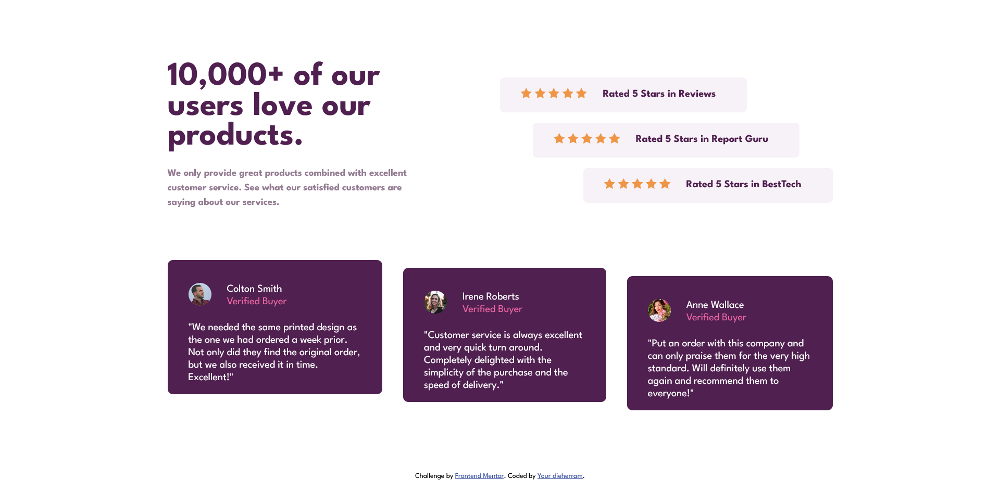
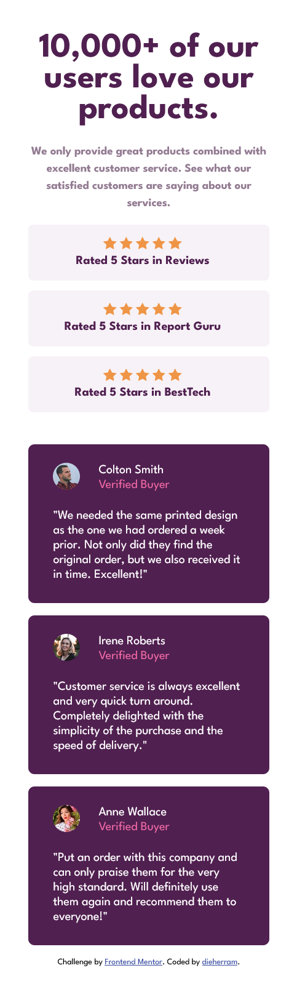

# Desafío Social Proof Section 🌟 de Frontend Mentor 😎

## Visión General 🚀
¡Hola! Este es mi intento de replicar la sección de Social Proof. El desafío consistió en construir esta sección y hacer que se vea lo más parecida posible al diseño original en diferentes dispositivos.

## Capturas de Pantalla 📸
### Escritorio 💻

### Móvil 📱

### Links

- Ver solución: [GitHub Pages](https://dieherram.github.io/fem-social-proof-section/)

## Mi Proceso 🤔
Enfoqué mi desarrollo en organizar el HTML y aplicar estilos con CSS, utilizando Flexbox para estructurar el contenido y hacerlo responsivo.

## Construido Con 🛠️
- HTML5
- CSS
- Flexbox

## What I Learned 🤓
Este proyecto me brindó la oportunidad de fortalecer mis habilidades en la creación de diseños responsivos.

## Continued Development 🚧
Continuaré optimizando la semántica HTML para aprovechar de manera más eficiente las reglas proporcionadas por CSS, mejorando así la accesibilidad y el mantenimiento del código.

## Author

- GitHub - [dieherram](https://github.com/dieherram)
- Frontend Mentor - [@dieherram](https://www.frontendmentor.io/profile/dieherram)
- Codewars - [@dieherram](https://www.codewars.com/users/dieherram)
- LinkedIn - [Diego Hernández Ramos](https://www.linkedin.com/in/diego-hernandez-ramos/)

## Acknowledgments 🙌
Agradezco a Frontend Mentor por proporcionar desafíos. ¡También a la increíble comunidad de desarrolladores! 🌟